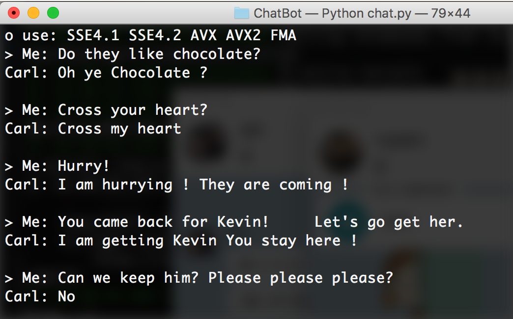

# 히어로봇(HeroBot)

- 한양대학교 캡스톤디자인 과제.
- Seq2Seq 모델을 이용한 챗봇.
- 영화 Up에서 주인공 Carl과 Russell의 대화가 포함되어 있습니다.

### 사용방법

기본적으로 다음 데이터를 사용합니다. config.py 파일에서 추가 옵션들을 확인해보세요.

- data/Up/Carl.csv : 대화 데이터
- data/Up/Up.voc : 어휘 데이터

### 채팅해보기

```
python chat.py
```



### 학습시키기

``` 
python train.py --train
```

학습된 모델이 있으면 새로 생성하지 않고 추가학습을 합니다.

다음과 같이 텐서보드를 통해 cost 를 확인할 수 있습니다.

```
tensorboard --logdir=./logs
```

### 테스트 해 보기

모델이 작동하는지만 봅니다. 정확도는 신뢰할 수 없습니다.

```
python train.py --test
```

### 어휘 데이터 생성하기

토크나이저를 바꿨거나 새로운 데이터를 이용하기를 원하는 경우, 다음과 같은 방법으로 먼저 어휘 데이터를 생성해야 합니다.

기본 토크나이저는 공백과 특수문자로 구분합니다.

```
python dialog.py --voc_build
```